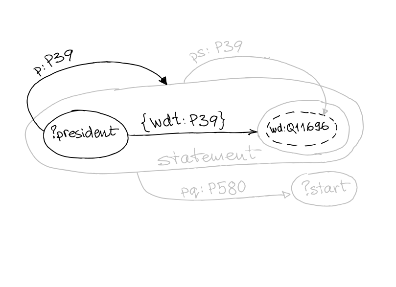

public:: false

- ### Properties for statements (Wikidata)
  id:: 5601edec-7d0a-4be1-b12c-8357da7b0b94
	- Item - Statement - Value - Qualifier Value
		- 
	- [[Example]]: US Presidents
		-
		- {:height 502, :width 680}
		- <iframe  src="https://w.wiki/wsi" style="width:100%;max-width:100%;height:450px" frameborder="0"></iframe>
		  #Query #Wikidata
	- See also ((61fe46bb-6fc5-4d5e-b917-d0da5b02a96a))
- ### Graph Visualization
	- Influence graph in the age of Enlightenment
		- <iframe src="https://w.wiki/4oDD" style="width:100%;max-width:100%;height:450px" frameborder="0"></iframe>
		  #Wikidata #Query
- ### Property Path
	- [[Syntax]]
		- |Syntax|Name|Matches|
		  |--|--|--|
		  |^property|Inverse Path|Inverse path (object to subject).|
		  |property1 / property2|Sequence Path|A sequence path of property1 followed by property2.|
		  |property1 `|` property2| Alternative Path| Property1 or property2 (all possibilities are tried).|
		  |property*|Zero Or More|A path that connects the subject and object of the path by zero or more matches of property.|
		  |property+|One Or More|A path that connects the subject and object of the path by one or more matches of property.|
		  |property?|Zero Or One Path|A path that connects the subject and object of the path by zero or one matches of property.|
	- [Property paths from the SPARQL 1.1 spec](https://www.w3.org/TR/sparql11-query/#propertypaths)
	-