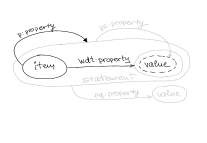

public:: false

- ### Properties for statements (Wikidata)
  id:: 5601edec-7d0a-4be1-b12c-8357da7b0b94
	- Item - Statement - Value - Qualifier Value
		- 
	- [[Example]]: US Presidents
		-
		- {:height 502, :width 680}
		- <iframe  src="https://w.wiki/wsi" style="width:100%;max-width:100%;height:450px" frameborder="0"></iframe>
		  #Query #Wikidata