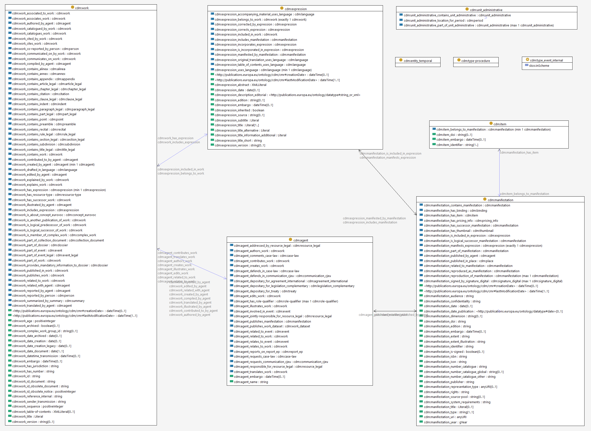

- type: [[Ontology]]
- [[CELLAR]]'s Common Data Model (CDM)
- [cdm - EU Vocabularies - Publications Office of the EU](https://op.europa.eu/en/web/eu-vocabularies/dataset/-/resource?uri=http://publications.europa.eu/resource/dataset/cdm)
- [[Class Diagram]][*](((61fb9031-930a-4300-8520-9aeed0826850)))
	- 
	- ---
		- [[Note]]
			- This view is incomplete. Some class hierarchies are missing or collapsed.
			  id:: 61fb9031-930a-4300-8520-9aeed0826850