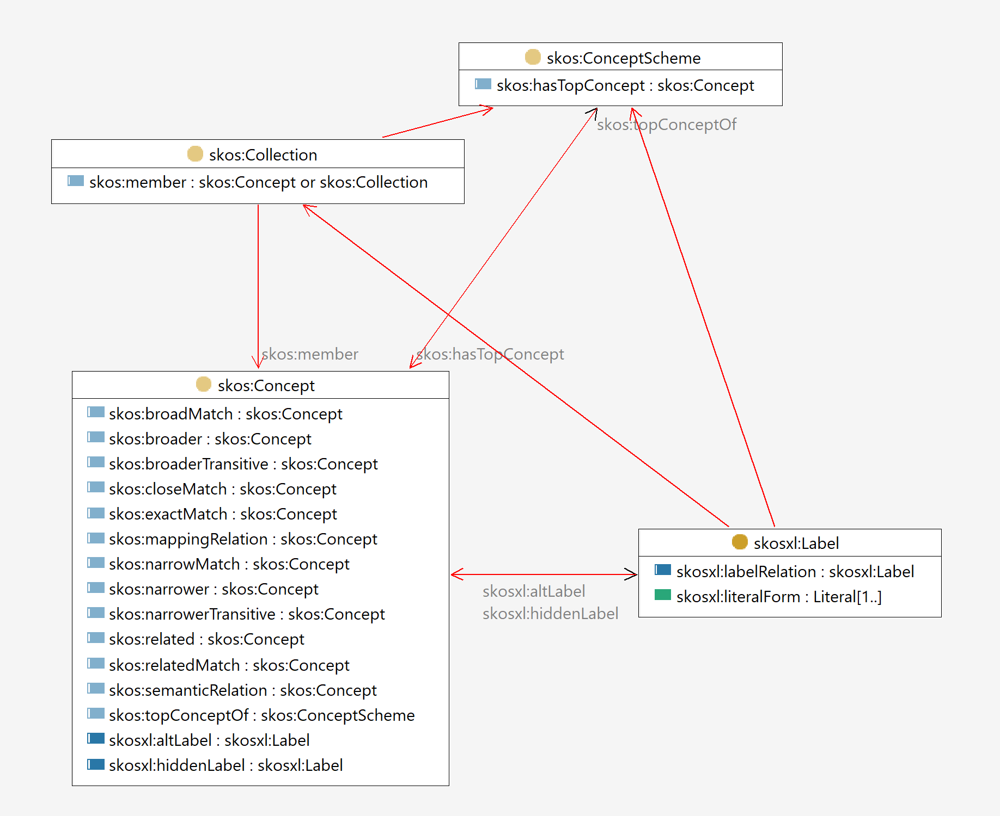

- type:: [[Ontology]]
- The specification of SKOS-XL is available as a [separate document](https://www.w3.org/TR/skos-reference/skos-xl.html) and as a [section within the SKOS specification](https://www.w3.org/TR/skos-reference/#xl).
- This page describes the resulting extended ontology SKOS + SKOS-XL which is what in practice is referred to as SKOS-XL.
- [[Class Diagram]]
	- {:height 628, :width 746}
- ## Classes
	- skos:Collection
	- skos:Concept
	- skos:ConceptScheme
	- skos:OrderedCollection
	- skosxl:Label
- ## Properties
	- ### Annotation properties
		- skos:altLabel
		- skos:changeNote
		- skos:definition
		- skos:editorialNote
		- skos:example
		- skos:hiddenLabel
		- skos:historyNote
		- skos:note
		- skos:prefLabel
		- skos:scopeNote
	- ### Object properties
		- skos:broadMatch
		- skos:broader
		- skos:broaderTransitive
		- skos:closeMatch
		- skos:exactMatch
		- skos:hasTopConcept
		- skos:inScheme
		- skos:mappingRelation
		- skos:member
		- skos:memberList
		- skos:narrowMatch
		- skos:narrower
		- skos:narrowerTransitive
		- skos:related
		- skos:relatedMatch
		- skos:semanticRelation
		- skos:topConceptOf
		- skosxl:altLabel
		- skosxl:hiddenLabel
		- skosxl:labelRelation[*](https://www.w3.org/TR/skos-reference/#xl-label-relations)
		- skosxl:prefLabel
	- ### Datatype properties
		- skos:notation
		- skosxl:literalForm
- Get all properties and classes of [[SKOS-XL]] (including [[SKOS]])
	- ```sparql
	  SELECT DISTINCT ?Class ?aProperty ?oProperty ?dProperty
	  WHERE {
	  {VALUES ?ns {"http://www.w3.org/2008/05/skos-xl#" "http://www.w3.org/2004/02/skos/core#"}
	  ?Class a owl:Class .
	  FILTER (strstarts(str(?Class), ?ns))}
	  
	  UNION
	  {
	  VALUES ?ns {"http://www.w3.org/2008/05/skos-xl#" "http://www.w3.org/2004/02/skos/core#"}
	  ?aProperty a owl:AnnotationProperty.
	  FILTER (strstarts(str(?aProperty), ?ns))
	  }
	  
	  UNION
	  
	  {VALUES ?ns {"http://www.w3.org/2008/05/skos-xl#" "http://www.w3.org/2004/02/skos/core#"}
	  ?oProperty a owl:ObjectProperty .
	  FILTER (strstarts(str(?oProperty), ?ns))}
	  
	  UNION
	  {VALUES ?ns {"http://www.w3.org/2008/05/skos-xl#" "http://www.w3.org/2004/02/skos/core#"}
	  ?dProperty a owl:DatatypeProperty .
	  FILTER (strstarts(str(?dProperty), ?ns))}
	  
	  }
	  ORDER BY  ?dProperty ?oProperty ?aProperty
	  ```
		- #VALUES #UNION #STRSTARTS #Query