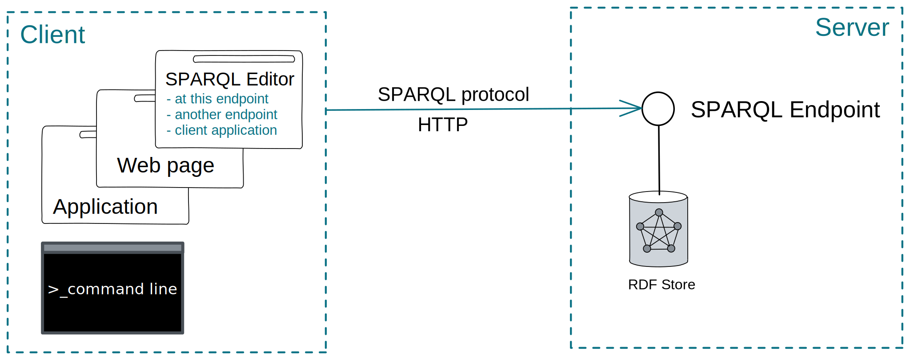
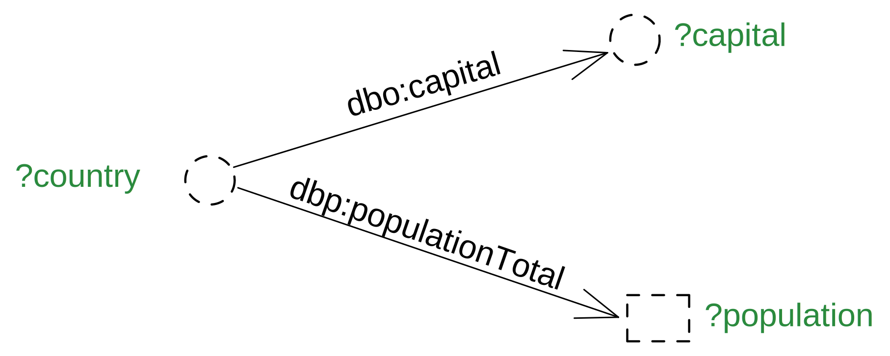
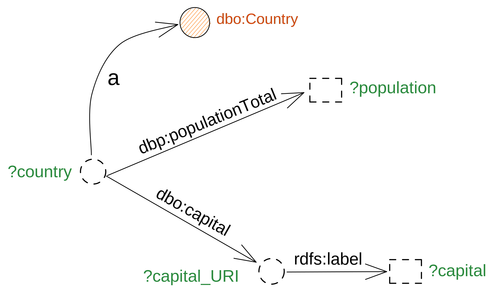
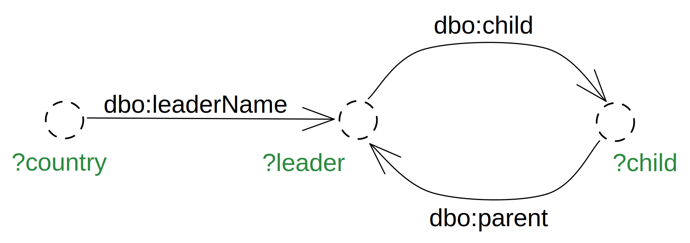
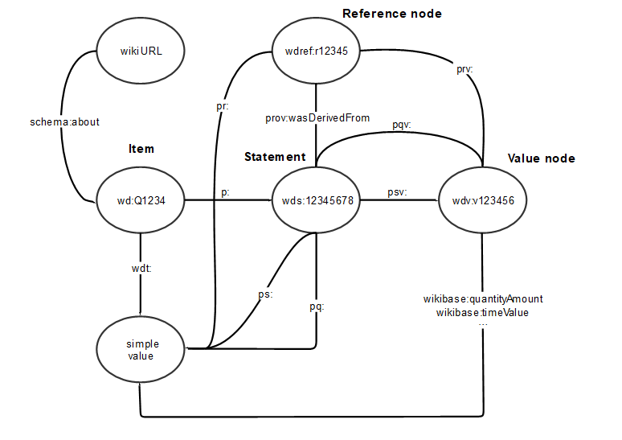
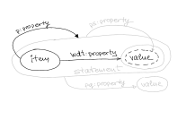
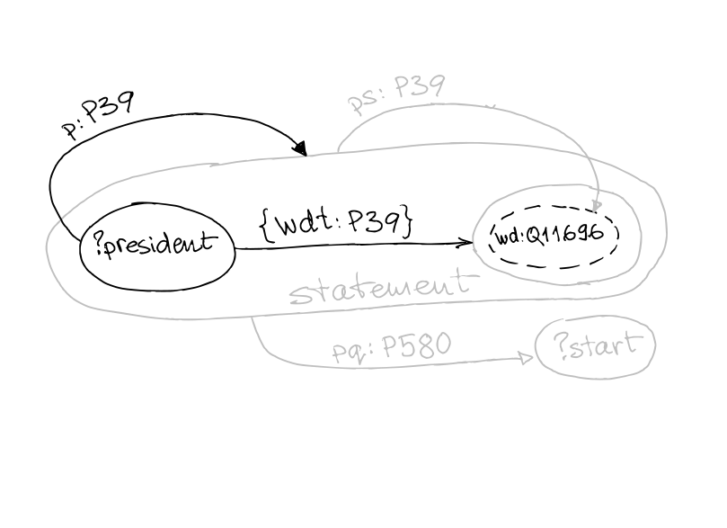
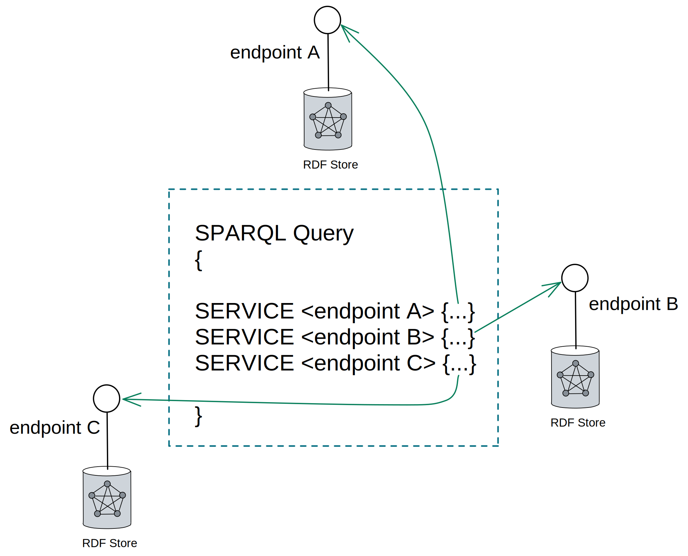
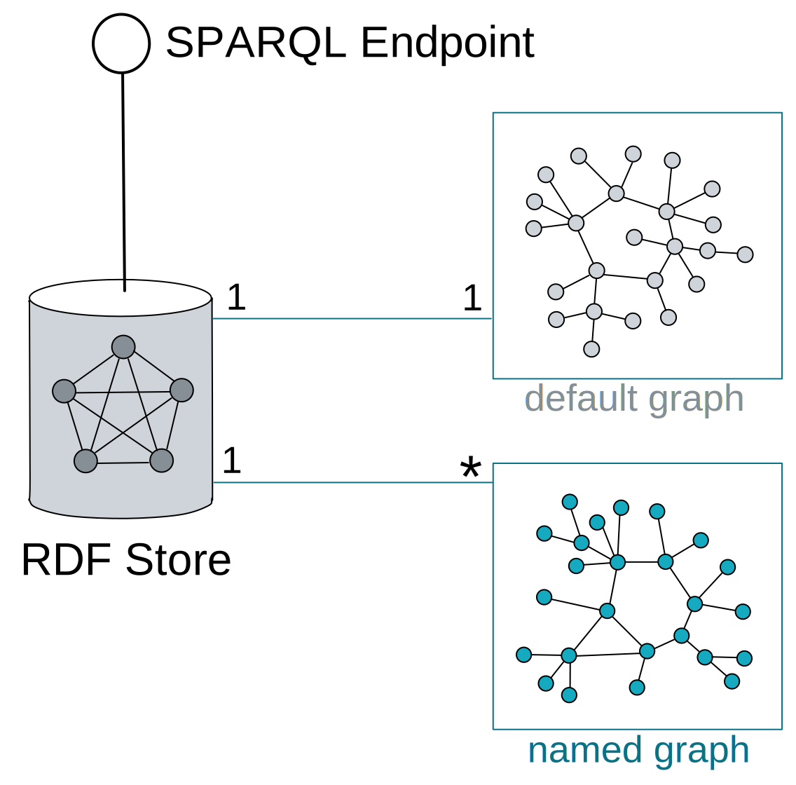

- All important points from the training course, collected for quick reference. See also [[Tutorial]]s.
- ### SPARQL Interactions
  id:: 626e4952-02cc-4c88-8565-139a93e6a98a
  collapsed:: true
	- {:height 304, :width 746}
	- See [[SPARQL Tools]]
- ### Two triple patterns, same subject
  id:: 626e4952-6ffd-494a-bbbf-122685d3d4f7
  collapsed:: true
	- ```sparql
	  SELECT ?country ?capital ?population 
	  
	  WHERE {
	  ?country dbo:capital ?capital .
	  ?country dbp:populationTotal ?population .
	  } 
	  ```
	  #Query #DBpedia
	- {:height 279, :width 522}
- ### Making another step in the graph
  id:: 626e4952-98ae-4115-93de-d9fd4156978c
  collapsed:: true
	- ```sparql
	  SELECT ?country ?population ?capital 
	  
	  WHERE {
	  ?country a dbo:Country .
	  ?country dbp:populationTotal ?population . 
	  ?country dbo:capital ?capital_URI .
	                       ?capital_URI   rdfs:label ?capital .
	  }
	  ```
	  #Query #DBpedia
	- {:height 373, :width 646}
	- collapsed:: true
	  ```sparql
	  PREFIX skos: <http://www.w3.org/2004/02/skos/core#>
	  PREFIX skosxl: <http://www.w3.org/2008/05/skos-xl#>
	  
	  SELECT * 
	  
	  WHERE {
	      
	      ?s skosxl:prefLabel ?Label_URI .
	      ?Label_URI skosxl:literalForm ?label .
	  
	      FILTER (LANG(?label) = "es")
	  } 
	  ```
		- #VocBench #Query
- ### Three patterns and two filters
  collapsed:: true
  id:: 626e4952-606b-45fe-8878-dfe4871a59fc
	- ```sparql
	  SELECT ?country ?population ?capital 
	  
	  WHERE {
	  ?country a dbo:Country; 
	              dbo:populationTotal ?population; 
	              dbo:capital ?capital_URI .
	  ?capital_URI rdfs:label ?capital .
	  
	  FILTER ( LANG(?capital) = "en" )
	  FILTER ( xsd:int(?population) > 10000000 )
	  } 
	  
	  ORDER BY DESC(?population)
	  ```
	  #Query #DBpedia #FILTER #LANG
- ### Counting and Binding
  collapsed:: true
  id:: 626e4952-dd36-4931-abc1-98e40bb1da76
	- ```sparql
	  SELECT (COUNT (?work_of_Agatha_Christie) AS ?Number_of_AC_works)
	  
	  {?work_of_Agatha_Christie dbo:author dbr:Agatha_Christie } 
	  ```
	  #Query #COUNT
- ### Functions on dates and times
  collapsed:: true
  id:: 626e4952-30dc-4bce-804c-fee5318b8244
	- [[NOW]]()
	- [[YEAR]]()
	- [[MONTH]]()
	- [[DAY]]()
	- [[HOURS]]()
	- [[MINUTES]]()
	- [[SECONDS]]()
	- [[Example]]
	  collapsed:: true
		- ```sparql
		  SELECT (MONTH(NOW()) AS ?currentMonth) { }
		  
		  ```
		  #Query
- ### Filtering resources with the same namespace
  id:: 626e4952-f335-485a-b3ae-474fb7777046
  collapsed:: true
	- Find all [[SKOS]] properties in use
		- ```sparql
		  SELECT DISTINCT ?property
		  WHERE {
		      ?s ?property ?o .
		      FILTER (STRSTARTS(STR(?property), "http://www.w3.org/2004/02/skos/core#" ))
		  }
		  ```
		  #Query #STRSTARTS
	- Find all classes of things that have author DBpedia
		- ```sparql
		  SELECT DISTINCT ?class
		  WHERE {
		    ?work dbo:author ?author . 
		    ?work a ?class .
		  FILTER (STRSTARTS(STR(?class),"http://dbpedia.org/ontology/" ))  
		  }
		  ```
		  #Query #STRSTARTS #DBpedia
- ### Negation
  collapsed:: true
  id:: 626e4952-7079-4ddb-a19d-72eb4dc7cca2
	- `NOT EXISTS` - Testing for absence of a pattern (recommended in most cases)
	- `MINUS`      -  Removing possible solutions
	- `!BOUND`     -  Not bound (produces the same results as `NOT EXISTS` but works also for SPARQL 1.0)
	- #+BEGIN_IMPORTANT
	  `NOT EXISTS` and `MINUS` have different logic and may produce different results on the same dataset.
	  #+END_IMPORTANT
	- ```sparql
	  SELECT DISTINCT ?leader 
	  
	  WHERE { 
	    ?MS a dbo:Country; 
	      dct:subject dbc:Member_states_of_the_European_Union;
	      dbp:leaderName ?leader . 
	    FILTER NOT EXISTS {?leader dbo:spouse ?spouse .}
	  }
	  
	  ORDER BY DESC(?leader)
	  
	  ```
	  #Query #FILTER #[[NOT EXISTS]]
- ### Optional results
  collapsed:: true
  id:: 626e4952-6483-438f-9a57-c210fdd6988a
	- ```sparql
	  SELECT DISTINCT ?leader ?spouse
	  
	  WHERE { 
	    ?MS a dbo:Country; 
	      dct:subject dbc:Member_states_of_the_European_Union;
	      dbp:leaderName ?leader . 
	    OPTIONAL {?leader dbo:spouse ?spouse .}
	  }
	  
	  ```
	  #Query #OPTIONAL
- ### Combining results
  collapsed:: true
  id:: 626e4952-211a-4446-b227-873a647fe005
	- ```sparql
	  SELECT DISTINCT  ?Influencer ?Influenced
	  
	  WHERE {
	  
	   {dbr:Ludwig_Wittgenstein dbo:influencedBy ?Influencer .}
	  
	  UNION
	  
	   {dbr:Ludwig_Wittgenstein dbo:influenced ?Influenced . }
	  }
	  
	  ```
	  #Query #UNION
	- #+BEGIN_NOTE
	  This query will not give complete results, unless inferred triples on inverse properties are included. To guarantee complete results relying only on SPARQL, the inverse property should be included. 
	  #+END_NOTE
- ### Search for string patterns
  id:: 61fd3a3d-81b5-448d-a76f-d1b0008b7476
  collapsed:: true
	- ```sparql
	  SELECT DISTINCT ?MusicalWork ?Artist
	  
	  WHERE {
	  ?MusicalWorkURI a dbo:MusicalWork ;
	                 rdfs:label ?MusicalWork ;
	                 dbo:artist ?ArtistURI .
	  
	  ?ArtistURI rdfs:label ?Artist .
	  
	  FILTER (lang(?MusicalWork) = "en")
	  FILTER (lang(?Artist) = "en")
	  FILTER REGEX (?MusicalWork, "broken", "i")
	  }
	  ORDER BY ?MusicalWork
	  ```
	  #Query #REGEX #FILTER #LANG
- ### Assembling strings
  collapsed:: true
  id:: 626e4952-d6a2-41d0-9766-10286789ae0c
	- ```sparql
	  PREFIX cdm: <http://publications.europa.eu/ontology/cdm#>
	  
	  SELECT ?reg (IRI(CONCAT(STR(?eli),"/eng/pdf")) AS ?pdf_URL)
	  
	  {
	    ?reg cdm:resource_legal_eli ?eli .
	  }
	  
	  LIMIT 1000
	  
	  ```
	  #Query #IRI #CONCAT #Cellar
- ### Property paths
  id:: 626e4952-c45c-4911-bda6-6c93293dbe9e
	- [[Syntax]]
		- ```sparql
		  #Inverse Path:
		      ^:property #Inverse path (object to subject)
		  #Sequence Path:
		      :property1/:property2  #A sequence path of :property1 followed by :property2
		  #Alternative Path:
		      :property1|:property2  #:property1 or property2 (all possibilities are tried)
		  #Zero Or More:
		      :property*  #A path that connects the subject and object of the path by zero or more matches of :property
		  #One Or More:
		      :property+  #A path that connects the subject and object of the path by one or more matches of :property
		  #Zero Or One Path:
		      :property?  #A path that connects the subject and object of the path by zero or one matches of :property
		  ```
		- [Property paths from the SPARQL 1.1 spec](https://www.w3.org/TR/sparql11-query/#propertypaths)
	- [[Example]]
	  collapsed:: true
		- ```sparql
		  SELECT (COUNT (DISTINCT ?child) AS ?Number_of_children)
		  
		  {
		  ?MS a dbo:Country; 
		      dct:subject dbc:Member_states_of_the_European_Union ;
		      dbp:leaderName ?leader . 
		  
		  ?leader dbo:child|^dbo:parent  ?child.
		  
		  #Works the same as 
		  #  {?leader dbo:child ?child.}
		  #  UNION
		  #  {?child dbo:parent ?leader}
		  } 
		  ```
		  #Query #| #^ #UNION
		- 
		- ```sparql
		  SELECT
		  (COUNT (DISTINCT ?Influencer) AS ?Num_Influencer) 
		  (COUNT (DISTINCT ?Influenced) AS ?Num_Influenced) 
		  
		  WHERE {
		  
		       {dbr:Ludwig_Wittgenstein dbo:influencedBy|^dbo:influenced ?Influencer .} 
		  
		     UNION 
		  
		       {dbr:Ludwig_Wittgenstein dbo:influenced|^dbo:influencedBy ?Influenced .} 
		  
		  } 
		  ```
		  #Query #DBpedia #| #^ #COUNT #UNION
		-
- ### Language tag
  collapsed:: true
  id:: 626e4952-9418-419f-918a-47f28f524f66
	- The current best practice for language tags is defined in [RFC5646](https://www.rfc-editor.org/rfc/rfc5646.txt).
	- [[LANGMATCHES]]
	  collapsed:: true
		- `FILTER (LANG(?label) = "fr")` will only return results where the language tag of `?label` is `@fr`, while `FILTER LANGMATCHES( LANG(?label), "fr" )` will also include those with regions such as `@fr-BE`.
- ### Wikibase data model
  collapsed:: true
  id:: 626e4952-c934-4fa9-a7e1-eb3803156299
	- 
- ### Wikidata label service
  collapsed:: true
  id:: 626e4952-5283-4052-a77e-c12132783160
	- Adding "Label" to a variable will get the label of the respective item if the Wikidata Label service is called in the query. For example, for ?item, ?itemLabel will get the labels in the selected language.
	- ```sparql
	  SELECT ?item ?itemLabel WHERE { ?item wdt:P31 wd:Q146 . 
	  
	  SERVICE wikibase:label { 
	                 bd:serviceParam wikibase:language “en" } 
	  } 
	  ```
	  #Query #Wikidata
	- #+BEGIN_TIP
	  To include a call to the Label Service in your query, just press Ctrl-Space and start typing "label" until you see the query fragment. Then change the language if needed.
	  
	  Check the [Label service manual](https://www.mediawiki.org/wiki/Wikidata_Query_Service/User_Manual#Label_service) for other capabilities. 
	  #+END_TIP
- ### Wikidata visualization service
  id:: 626e4952-d248-4ef9-8f71-5b0cb5a0f824
  collapsed:: true
	- Influence graph in the age of Enlightenment
		- <iframe src="https://w.wiki/4oDD" style="width:100%;max-width:100%;height:450px" frameborder="0"></iframe>
		  #Wikidata #Query #FILTER #&&
	- Roman diaties
		- <iframe src="https://w.wiki/5BLU" style="width:100%;max-width:100%;height:450px" frameborder="0"></iframe> #| #^ #Wikidata #Query
- ### Properties for statements (Wikidata)
  id:: 600748be-0c7a-4b4c-807d-a5c41f8ee80e
	- Item - Statement - Value - Qualifier Value
		-  #Wikidata
	- [[Example]]: US Presidents
		-
		- {:height 502, :width 680}
		- With `?statement` variable <iframe src="https://w.wiki/4wNL" style="width:100%;max-width:100%;height:450px" frameborder="0"></iframe>
		  #Query #Wikidata #Qualifiers
		- With blank nodes <iframe  src="https://w.wiki/wsi" style="width:100%;max-width:100%;height:450px" frameborder="0"></iframe>
		  #Query #Wikidata #Qualifiers
	- See also ((61fe46bb-6fc5-4d5e-b917-d0da5b02a96a))
- ### Providing list of input VALUES
  collapsed:: true
  id:: 626e4952-8b32-4fc4-b3a2-6e24c7824ada
	- ```sparql
	  # Example with a block of values, where the third block in the list has no value for ?v2
	  VALUES (?v1 ?v2) {(:c11 :c21) (:c21 :c22) (:c21 UNDEF)}
	  
	  # When value for only one variable are provided, () can be omitted 
	  VALUES ?v1 {:c1 :c2 :c3 :cN}
	  
	  ```
	  #VALUES
	- Get the list of notable books on linked data, semantic technologies, and semantic knowledge graphs.
		- <iframe src="https://w.wiki/4yao" style="width:100%;max-width:100%;height:450px" frameborder="0"></iframe>
- ### Grouping results with GROUP_CONCAT
  id:: 626e4952-ad6c-4838-bab3-c76ce434120a
	- ```sparql
	  (GROUP_CONCAT (?V; SEPARATOR = ", ") AS ?groupV)
	  
	  ```
	  #GROUP_CONCAT
	- <iframe src="https://w.wiki/6EZa" style="width:100%;max-width:100%;height:450px" frameborder="0"></iframe> #Wikidata #Query #GROUP_CONCAT #|| #OPTIONAL
- ### Federated queries
  collapsed:: true
  id:: 626e4952-1bba-4499-b273-3034b07779b4
	- {:height 500, :width 643}
- ### Default and named graphs
  id:: 626e4952-3b13-47d8-a7e4-ad95ca6b68e2
  collapsed:: true
	- {:height 454, :width 498}
	- Default graph
	  `FROM <>`
	  Used when not explicitly specified
	- Named graph
	  `FROM NAMED <>`
	  Can be directly specified or through a variable
	- Available named graphs at an endpoint
		- ```sparql
		  SELECT DISTINCT ?g 
		   WHERE { 
		      GRAPH ?g {?s ?p ?o .} 
		   } 
		  ```
		  #Query #GRAPH
- ### Other query forms
  id:: 626e4952-fb6b-4afc-8dac-d0bec45a3a8e
  collapsed:: true
	- ASK
		- If there is at least one result
			- `ASK WHERE {...}`
	- DESCRIBE
		- Describes a particular resource
		- All directly linked nodes
		- Not strictly specified
	- [[CONSTRUCT]]
		- Create new graph from a template
		- Use SPARQL as template to
			- Copy
			- Create
			- Convert
				- From RDF to RDF
					- Applying different ontologies
					- Generating URIs
				- From CSV to RDF (e.g. using [Tarql](http://tarql.github.io))
		- Result
			- Triples (virtual graph)
		- [[Example]]
			- SKOS from SKOS-XL
				- ```sparql
				  CONSTRUCT {
				      ?concept skos:prefLabel ?prefLabel_ES .}
				  
				  WHERE {
				  ?concept skosxl:prefLabel ?prefLabel .
				  ?prefLabel skosxl:literalForm ?prefLabel_ES .
				  FILTER (LANG(?prefLabel_ES) = "es")
				  }
				  ```
				  #Query #CONSTRUCT #FILTER #LANG