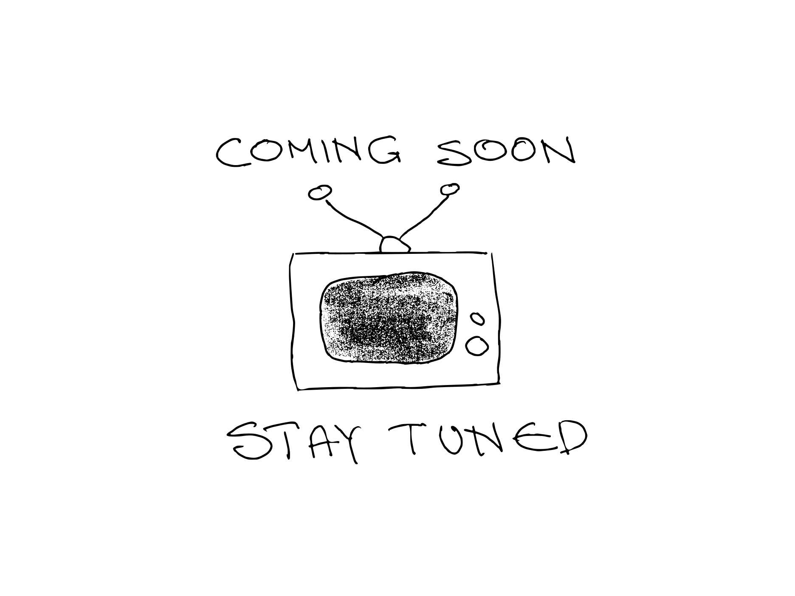

- All important points from the training course, collected for quick reference. See also [[Tutorial]]s.
- ### SPARQL Interactions
	- {:height 304, :width 746}
	- See [[SPARQL Editors]]
- ### Two triple patterns, same subject
	- ```sparql
	  SELECT ?country ?capital ?population 
	  
	  WHERE {
	  ?country dbo:capital ?capital .
	  ?country dbp:populationTotal ?population .
	  } 
	  ```
	  #Query #DBpedia
	- {:height 279, :width 522}
- ### Making another step in the graph
	- ```sparql
	  SELECT ?country ?population ?capital 
	  
	  WHERE {
	  ?country a dbo:Country .
	  ?country dbp:populationTotal ?population . 
	  ?country dbo:capital ?capital_URI .
	                       ?capital_URI   rdfs:label ?capital .
	  }
	  ```
	  #Query #DBpedia
	- {:height 373, :width 646}
	- ```sparql
	  PREFIX skos: <http://www.w3.org/2004/02/skos/core#>
	  PREFIX skosxl: <http://www.w3.org/2008/05/skos-xl#>
	  
	  SELECT * 
	  
	  WHERE {
	      
	      ?s skosxl:prefLabel ?Label_URI .
	      ?Label_URI skosxl:literalForm ?label .
	  
	      FILTER (LANG(?label) = "es")
	  } 
	  ```
		- #VocBench #Query
- ### Three patterns and two filters
	- ```sparql
	  SELECT ?country ?population ?capital 
	  
	  WHERE {
	  ?country a dbo:Country; 
	              dbo:populationTotal ?population; 
	              dbo:capital ?capital_URI .
	  ?capital_URI rdfs:label ?capital .
	  
	  FILTER ( LANG(?capital) = "en" )
	  FILTER ( xsd:int(?population) > 10000000 )
	  } 
	  
	  ORDER BY DESC(?population)
	  ```
	  #Query #DBpedia #FILTER #LANG
- ### Counting and Binding
	- ```sparql
	  SELECT (COUNT (?work_of_Agatha_Christie) AS ?Number_of_AC_works)
	  
	  {?work_of_Agatha_Christie dbo:author dbr:Agatha_Christie } 
	  ```
	  #Query #COUNT
- ### Functions on dates and times
	- [[NOW]]()
	- [[YEAR]]()
	- [[MONTH]]()
	- [[DAY]]()
	- [[HOURS]]()
	- [[MINUTES]]()
	- [[SECONDS]]()
	- [[Example]]
		- ```sparql
		  SELECT (MONTH(NOW()) AS ?currentMonth) { }
		  
		  ```
		  #Query
- ### Filtering resources with the same namespace
	- Find all [[SKOS]] properties in use
		- ```sparql
		  SELECT DISTINCT ?property
		  WHERE {
		      ?s ?property ?o .
		      FILTER (STRSTARTS(STR(?property), "http://www.w3.org/2004/02/skos/core#" ))
		  }
		  ```
		  #Query #STRSTARTS
- ### Negation
	- `NOT EXISTS` - Testing for absence of a pattern (recommended in most cases)
	- `MINUS`      -  Removing possible solutions
	- `!BOUND`     -  Not bound (produces the same results as `NOT EXISTS` but works also for SPARQL 1.0)
	- #+BEGIN_IMPORTANT
	  `NOT EXISTS` and `MINUS` have different logic and may produce different results on the same dataset.
	  #+END_IMPORTANT
	- ```sparql
	  SELECT DISTINCT ?leader 
	  
	  WHERE { 
	    ?MS a dbo:Country; 
	      dct:subject dbc:Member_states_of_the_European_Union;
	      dbp:leaderName ?leader . 
	    FILTER NOT EXISTS {?leader dbo:spouse ?spouse .}
	  }
	  
	  ORDER BY DESC(?leader)
	  
	  ```
	  #Query #FILTER #[[NOT EXISTS]]
- ### Optional results
	- ```sparql
	  SELECT DISTINCT ?leader ?spouse
	  
	  WHERE { 
	    ?MS a dbo:Country; 
	      dct:subject dbc:Member_states_of_the_European_Union;
	      dbp:leaderName ?leader . 
	    OPTIONAL {?leader dbo:spouse ?spouse .}
	  }
	  
	  ```
	  #Query #OPTIONAL
- ### Combining results
	- ```sparql
	  SELECT DISTINCT  ?Influencer ?Influenced
	  
	  WHERE {
	  
	   {dbr:Ludwig_Wittgenstein dbo:influencedBy ?Influencer .}
	  
	  UNION
	  
	   {dbr:Ludwig_Wittgenstein dbo:influenced ?Influenced . }
	  }
	  
	  ```
	  #Query #UNION
	- #+BEGIN_NOTE
	  This query will not give complete results, unless inferred triples on inverse properties are included. To guarantee complete results relying only on SPARQL, the inverse property should be included. See ((61fd57ec-536d-4dbf-ae91-8f67c84f4daf)).
	  #+END_NOTE
- ### Search for string patterns
  id:: 61fd3a3d-81b5-448d-a76f-d1b0008b7476
	- ```sparql
	  SELECT DISTINCT ?MusicalWork ?Artist
	  
	  WHERE {
	  ?MusicalWorkURI a dbo:MusicalWork ;
	                 rdfs:label ?MusicalWork ;
	                 dbo:artist ?ArtistURI .
	  
	  ?ArtistURI rdfs:label ?Artist .
	  
	  FILTER (lang(?MusicalWork) = "en")
	  FILTER (lang(?Artist) = "en")
	  FILTER REGEX (?MusicalWork, "broken", "i")
	  }
	  ORDER BY ?MusicalWork
	  ```
	  #Query #REGEX #FILTER #LANG
- ### Assembling strings
	- ```sparql
	  PREFIX cdm: <http://publications.europa.eu/ontology/cdm#>
	  
	  SELECT ?reg (IRI(CONCAT(STR(?eli),"/eng/pdf")) AS ?pdf_URL)
	  
	  {
	    ?reg cdm:resource_legal_eli ?eli .
	  }
	  
	  LIMIT 1000
	  
	  ```
	  #Query #IRI #CONCAT #Cellar
- ### Property path
	- [[Syntax]]
		- ```sparql
		  #Inverse Path:
		      ^:property #Inverse path (object to subject)
		  #Sequence Path:
		      :property1/:property2  #A sequence path of :property1 followed by :property2
		  #Alternative Path:
		      :property1|:property2  #:property1 or property2 (all possibilities are tried)
		  #Zero Or More:
		      :property*  #A path that connects the subject and object of the path by zero or more matches of :property
		  #One Or More:
		      :property+  #A path that connects the subject and object of the path by one or more matches of :property
		  #Zero Or One Path:
		      :property?  #A path that connects the subject and object of the path by zero or one matches of :property
		  ```
		- [Property paths from the SPARQL 1.1 spec](https://www.w3.org/TR/sparql11-query/#propertypaths)
	- [[Example]]
		- ```sparql
		  SELECT (COUNT (DISTINCT ?child) AS ?Number_of_children)
		  
		  {
		  ?MS a dbo:Country; 
		      dct:subject dbc:Member_states_of_the_European_Union ;
		      dbp:leaderName ?leader . 
		  
		  ?leader dbo:child|^dbo:parent  ?child.
		  
		  #Works the same as 
		  #  {?leader dbo:child ?child.}
		  #  UNION
		  #  {?child dbo:parent ?leader}
		  } 
		  ```
		  #Query #| #^ #UNION
		- 
		-
- ### Language tag
	- The current best practice for language tags is defined in [RFC5646](https://www.rfc-editor.org/rfc/rfc5646.txt).
	- [[LANGMATCHES]]
		- `FILTER (LANG(?label) = "fr")` will only return results where the language tag of `?label` is `@fr`, while `FILTER LANGMATCHES( LANG(?label), "fr" )` will also include those with regions such as `@fr-BE`.
- ### Wikidata Language and visualization service
  collapsed:: true
	- Influence graph in the age of Enlightenment
		- <iframe src="https://w.wiki/4oDD" style="width:100%;max-width:100%;height:450px" frameborder="0"></iframe>
		  #Wikidata #Query #FILTER #&&
- ### Properties for statements (Wikidata)
	- 