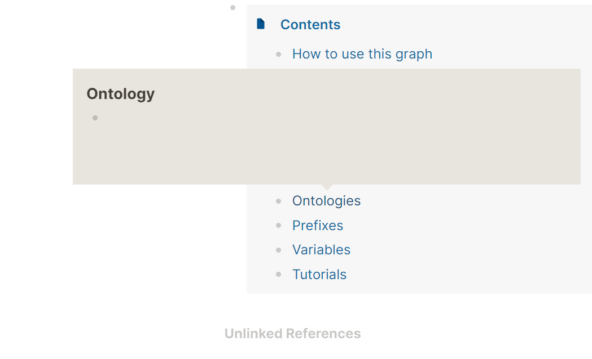

public:: false

- TODO Get SPARQL endpoints by query
  :LOGBOOK:
  CLOCK: [2022-03-09 Wed 07:42:28]--[2022-03-09 Wed 07:42:30] =>  00:00:02
  :END:
- TODO Add to [[SPARQL training course]], more on property paths etc (take from PDFs, it's lots in PPT)
- TODO Test very big export
- TODO Hide unlinked refs
  :LOGBOOK:
  CLOCK: [2022-03-22 Tue 13:59:45]--[2022-03-22 Tue 13:59:47] =>  00:00:02
  :END:
- TODO Fix block ref CSS in Bonofix
- TODO Start adding SPARQL tools like SPARQL Generate Traql and SPARQL anything
	- separate pages with metadata
	- stanartise with endpoints
	- then create a query page, and that page should go to the content.
- DONE Replace the favicon
- DOING Add shortcuts to How to use this graph (ore separate page)
  :LOGBOOK:
  CLOCK: [2022-03-09 Wed 08:29:48]
  :END:
- TODO All pages, first those included in Conent, should have description
  collapsed:: true
	- 
- TODO Fix issues with ((5601edec-7d0a-4be1-b12c-8357da7b0b94)) images
  collapsed:: true
	- open on the sidebar
- DONE Consider showing 'All Pages'
- TODO Show property hierarchy for
  collapsed:: true
	- DONE SKOS-XL
	- TODO CDM
- ---
- {{embed [[BACKLOG]]}}
- ## Conditional
	- If the repository gets public
		- TODO Restructure so that GitHub readme is outside Logseq folder
	- If it's decided for a wide promotion
		- TODO Add explanations pertinent to VocBench and other OP-specific elements which wouldn't normally be present in a general SPARQL tutorial.
- [[DONE]]
	- DONE CSS - hide elements
		- DONE Remove also favorites form left sidebar
	- DONE Write home page
	- DONE Write tips and tricks by adapting EP Nodebook (why nodebook)
	- DONE Remove Favorites page and other useless elements: for example Settings, Import, Join the community, Help etc. are still published
- ---
- Publication checklist
	- Remove favorites if kept